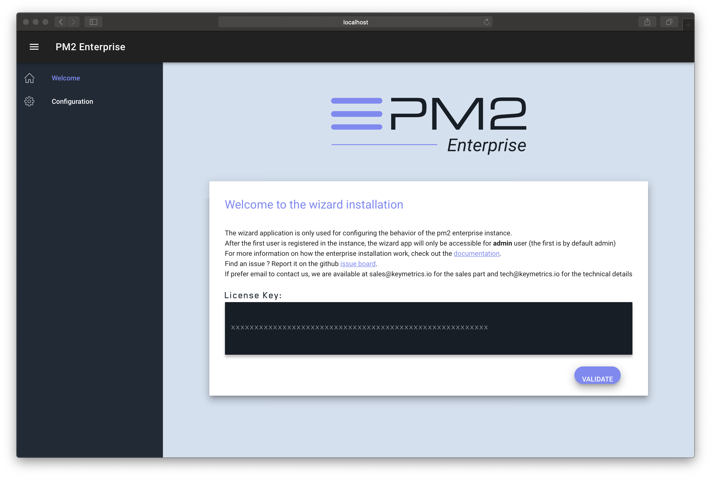

# PM2 EE Baremetal deployment

- [Base Requirements](#base-requirements)
- [Base Setup](#base-setup)
- [Startup PM2 Enterprise](#startup-pm2-enterprise)
- [Configure PM2 Enterprise](#configure-pm2-enterprise)
- [Update PM2 Enterprise](#update-pm2-enterprise)
- [Connect PM2 Runtime to the On-Premise](#connect-pm2-runtime-to-the-on-premise)

## Base Requirements

### Information Required

1. You must have been provided a License Key (provided by our team)
1. Your Docker Hub account must have been allowed to access to PM2 Enterprise Docker Images on the [Keymetrics organization](https://hub.docker.com/u/keymetrics). Images are `km-api-dedicated`, `km-wizard-dedicated` and `noex-enterprise`.

### Software Required

- Docker: 17.12.0 (package: 1.5)
- Docker-compose: 1.8.0 (package: 1.8.0)

### How to install Docker and Docker Compose

```bash
sudo wget -qO- https://get.docker.com/ | sh
sudo curl -L https://github.com/docker/compose/releases/download/1.19.0/docker-compose-`uname -s`-`uname -m` -o /usr/local/bin/docker-compose
sudo chmod +x /usr/local/bin/docker-compose
```

Then make sure you have logged-in on the official docker hub to be able to pull the private images:

```bash
docker login
```

## Base Setup

You have two docker-compose files available, one to expose the app over HTTP and another one over HTTPS.

### Expose over HTTP

If you already have a piece of software that handle the HTTPS for you or that you prefer using HTTP, you can get this dockerfile :

```bash
wget https://raw.githubusercontent.com/keymetrics/on-premise/master/docker/docker-compose.yml
```

### Expose over HTTPS

Otherwise, download the docker compose with the SSL configured into your nginx instance:

```bash
wget https://raw.githubusercontent.com/keymetrics/on-premise/master/docker/docker-compose.ssl.yml
mv docker-compose.ssl.yml docker-compose.yml
```

Then you will need to put these two files on the host which is running PM2 Enterprise:
- Your private certificate on the path `/etc/ssl/pm2-ssl-certificate.crt`
- Your private key on the path `/etc/ssl/pm2-ssl-certificate.key`

If you want to use a custom proxy, you can find the nginx configuration that we use [here](https://github.com/keymetrics/on-premise/blob/master/docker/dockerfiles/nginx.conf) to configure the correct redirection for each service.

## Startup PM2 Enterprise

Once the requirements are met and that you have choose the right docker-compose.yml, you can then start PM2 Enterprise:

```bash
docker-compose up -d
```

Check the logs via:

```bash
docker-compose logs
```

| In the beginning some connections errors might appears but it's not critical (elasticsearch take few seconds to boot so the backend will restart for few seconds then connect when his ready)

## Configure PM2 Enterprise



**NOTE**: `instance_address` is the IP or Domain name you want PM2 Enterprise to be exposed on

1. Connect to the Wizard by opening your browser to `<instance_address>/wizard`
1. Paste your license key provided by the technical team and click on *Go to configuration*.
1. Add the *public address* as `instance_address`. If you want to use a proxy in front of this instance (like Nginx), you have to configure the address here.

NB: If you use the SSL setup, you must check the advanced configuration in *General/Websocket address* and use `wss` protocol instead of `ws`
NB: When your installation is complete, you must stop the wizard:

### Disabling the Wizard

Once PM2 Enterprise is configured, you must stop the wizard with the following command:

```bash
docker-compose stop km-wizard
```

### Update Configuration

You can modify the configuration after the first install, but you must restart all the apps manually after changing the configuration

```bash
# Start the Wizard
docker-compose start km-wizard
# Connect to <instance_address>/wizard and edit the configuration
# Restart all PM2 Enterprise instances to update configuration
docker-compose restart
```

## Update PM2 Enterprise

To get the latest updates, you just have to run docker-compose up again and it will pull the latest backend image:

```bash
cd /folder/containing/docker-compose.yml
docker-compose pull
```

A downtime of around 30 seconds maximum will happen. During this downtimes agents will buffer their data and send them back once the installation is online.

## Connect PM2 Runtime to the On-Premise

Make sure you have created a bucket on your on-premise interface.

### With PM2 Runtime CLI
Then retrieve the Secret and Public keys and connect PM2 Runtime like that:

```
KEYMETRICS_NODE=<instance_address> pm2 link <secret> <public> [machine name]
```

### With PM2 Standalone Agent

If you use the PM2 Standalone Agent, first make sure that you have installed the `@pm2/io` module and you have required it at the very beggining of your Node.js application:

```javascript
const io = require('@pm2/io').init({
  standalone: true,                       // mandatory
  apmOptions: {
    publicKey: process.env.KM_PUBLIC_KEY,   // define the public key given in the dashboard
    secretKey: process.env.KM_SECRET_KEY,   // define the private key given in the dashboard
    appName: process.env.KM_APP_NAME       // define an application name
  }
})
```

And make sur the `KEYMETRICS_NODE` variable is exposed when starting your Node.js app:

```bash
KEYMETRICS_NODE=<instance_address> node app.js
```


